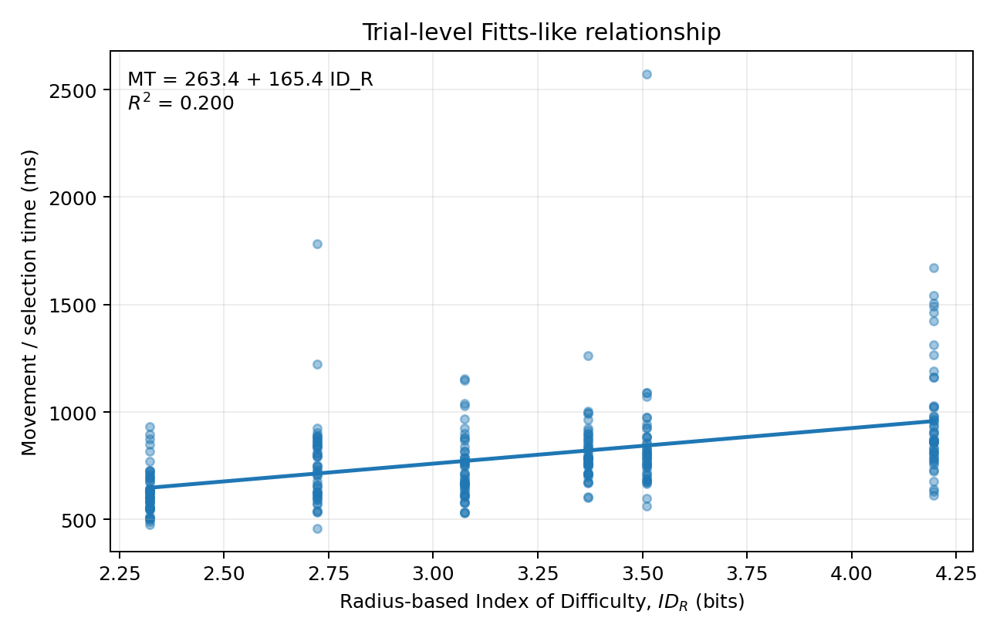
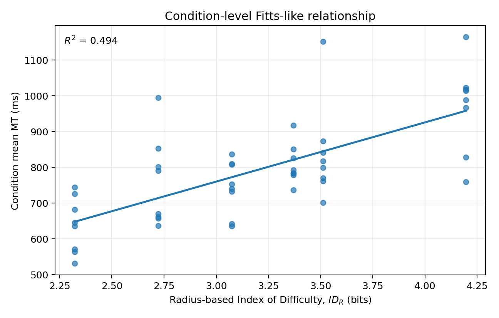
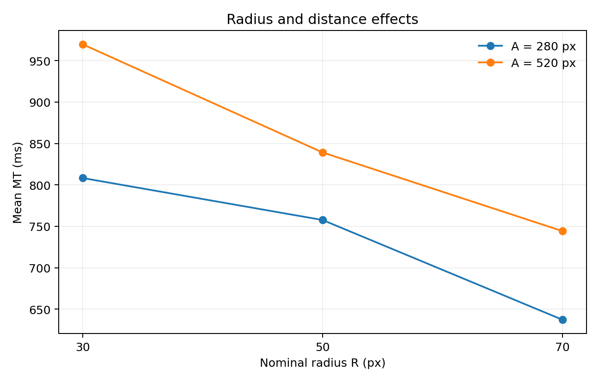
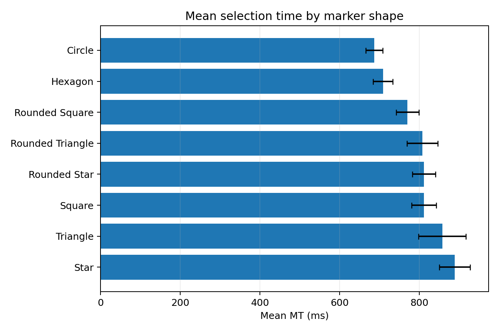
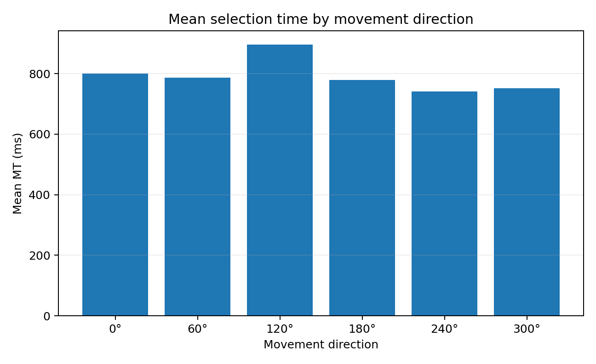

[English](./README.md) | [繁體中文](./README_zh-TW.md)

# HCI-FittsLawTest

**[直接開啟線上實驗（Open Online Experiment）](https://eaglechiu.github.io/HCI-FittsLawTest/)**

本專案以互動地圖標記選取，研究菲茲定律（Fitts' Law）與目標幾何形狀（Target Geometry）的人機互動（Human–Computer Interaction, HCI）實驗。

使用者需要在地圖上尋找並點擊青色目標標記（Target Marker），背景同時呈現一至五個灰色干擾標記（Distractor Markers）。本實驗控制移動距離、標記外接圓半徑與移動方向，觀察不同形狀對選取時間（Selection Time）與誤點次數（Misses）的影響。

| 實驗因素（Experimental Factor） | 設定（Configuration） |
| --- | --- |
| 目標形狀（Target Shape） | 8 種 |
| 外接圓半徑（Circumradius, R） | 30、50、70 px |
| 中心間移動距離（Center-to-center Movement Distance, A） | 280、520 px |
| 移動方向（Movement Direction） | 0°、60°、120°、180°、240°、300° |
| 正式試驗（Recorded Trials） | 48 個條件 × 每個條件 6 次，共 288 次 |
| 實驗階段（Sessions） | 2 個階段，每階段 144 次 |

> **研究解讀：** 原報告將資料定位為單一使用者的先導研究（Within-user Pilot Study）。288 次重複量測（Repeated Measurements）不等於 288 位獨立受試者；報告中的 p 值（p-values）屬探索性結果，不能直接推論至一般使用者族群。自訂的半徑式難度指標（Radius-based Index of Difficulty, ID_R）也不等同於傳統以方向寬度（Directional Width, W）定義的難度指標。

## 開始使用（Getting Started）

1. 使用桌面瀏覽器（Desktop Browser）開啟[線上實驗（Online Experiment）](https://eaglechiu.github.io/HCI-FittsLawTest/)，不需要下載或安裝。
2. 依照頁面提示開始實驗，尋找並點擊青色標記。每個條件先進行一次不記錄的暖身定位（Warm-up Positioning），再進行六次正式選取。
3. 完成兩個實驗階段（Sessions）後，使用頁面上的匯出功能保存結果。若要在不同瀏覽器或裝置間轉移進度，請使用進度匯出／匯入（Export / Import Progress）功能。

網站使用 GitHub Pages 提供靜態網站服務，也可下載 [HTML 檔案](./fitts_interactive_map_6dir.html)離線執行。進度保存在瀏覽器的本機儲存空間（`localStorage`）；更換瀏覽器或清除網站資料前，請先匯出備份。下載版與線上版不會自動共用進度；若要轉移，請先在原頁面選擇 `Download Progress Backup`，再於新頁面使用 `Import Progress`。地圖需要足夠的桌面顯示空間，才能容納最長 520 px 的移動距離。

## 實驗操作影片（Experiment Demo）

觀看互動地圖標記選取實驗的操作影片：

https://github.com/user-attachments/assets/2a0c2c05-e243-43af-ab42-e0e72b4fa22c

## 內容導覽（Contents）

- [完整報告](#full-report)
- [1. 執行摘要](#section-1)
- [2. 情境、創新與應用](#section-2)
- [3. 實驗設計](#section-3)
- [4. 結果](#section-4)
- [5. 討論](#section-5)
- [6. 限制](#section-6)
- [7. 結論](#section-7)
- [附錄 A：關鍵資料集檢查](#appendix-a)

## 檔案（Files）

| 路徑（Path） | 內容（Contents） |
| --- | --- |
| [`index.html`](./index.html) | GitHub Pages 入口 |
| [`fitts_interactive_map_6dir.html`](./fitts_interactive_map_6dir.html) | 六方向互動地圖實驗（Six-direction Interactive Map Experiment） |
| [`README.md`](./README.md) | 英文專案介紹與完整報告 |
| [`README_zh-TW.md`](./README_zh-TW.md) | 繁體中文專案介紹與完整報告 |
| [`assets/report/`](./assets/report/) | 原報告的五張圖（Five Original Report Figures） |

## 完整報告（Full Report）

### 互動地圖中目標幾何形狀對菲茲定律選取表現的影響

人工智慧輔助的菲茲定律實驗與實證分析（AI-Assisted Fitts' Law Experiment and Empirical Analysis）

| 欄位 | 詳細資料 |
| --- | --- |
| 課程／作業 | 人機互動－菲茲定律實驗，第二部分 |
| 情境 | 互動式監控地圖的標記選取 |
| 資料集 | 288 次正式試驗，分為兩個實驗階段 |
| 學生 | ［邱奕高／112034011］ |
| 日期 | 2026/09/20 |

### 1. 執行摘要（Executive Summary）

**研究問題：** 在控制移動距離與標記名目半徑的情況下，標記的幾何形狀是否會對互動地圖任務的選取時間產生額外影響？

**主要結果：** 半徑式菲茲模型（Radius-based Fitts Model）MT = 263.38 + 165.44 ID_R，可解釋單次試驗層級 20.0% 的變異（R² = 0.200）。將每個「形狀 × 半徑 × 距離」條件中的六次重複試驗取平均後，R² 提高至 0.494。若進一步平均不同形狀，只保留六個「半徑 × 距離」條件，R² 達到 0.949，顯示底層存在明顯的類菲茲關係（Fitts-like Relationship）。

**結果解讀：** 距離與半徑的效果符合預期：目標越遠，選取速度越慢；目標越大，選取速度越快。目標形狀與移動方向在 ID_R 之外增加了系統性變異；干擾標記數量（1–5 個）與實驗階段編號在目前資料集中則未顯示可偵測的效果。因此，本實驗較適合以地圖標記設計來解讀，而非視為單純的雙目標菲茲任務。

### 2. 情境、創新與應用（Scenario, Innovation, and Application）

#### 2.1 情境（Scenario）

本實驗模擬包含多種幾何標記的互動式監控地圖。每次試驗會以青色標示一個目標，並以灰色顯示一至五個干擾標記。參與者需要盡快且準確地辨識並點擊青色標記。下一個目標會依照受控的中心間移動距離，放置在上一個已選取目標的相對位置。

#### 2.2 創新（Innovation）

傳統的菲茲式任務（Fitts-style Task）主要操弄目標距離與目標大小。本實驗在維持固定顏色規則與平衡移動方向的同時，加入目標幾何形狀作為受控因素，藉此檢驗具有相同名目半徑的不同幾何標記，是否具有相同的可選取性（Selectability）。

#### 2.3 實務應用（Practical Application）

本研究結果可應用於使用幾何符號代表不同物件或事件類型的地圖、儀表板與監控介面。若相同名目半徑無法使不同形狀產生相同的選取表現，介面設計者可能需要依形狀設定不同的最小標記尺寸，或為較難選取的幾何形狀配置超出視覺邊界的隱形點擊區域（Invisible Hit Area）。

### 3. 實驗設計（Experimental Design）

#### 3.1 自變項與依變項（Independent and Dependent Variables）

| 變項 | 層級／定義 |
| --- | --- |
| 目標形狀 | 8 種：圓形（Circle）、六邊形（Hexagon）、圓角正方形（Rounded Square）、圓角三角形（Rounded Triangle）、圓角星形（Rounded Star）、正方形（Square）、三角形（Triangle）、星形（Star） |
| 名目半徑 R | 30、50、70 px |
| 移動距離 A | 280、520 px（中心到中心） |
| 移動方向 | 0°、60°、120°、180°、240°、300°；每個條件各出現一次 |
| 干擾標記 | 1–5 個灰色標記；各試驗間大致平衡 |
| 依變項 | 選取時間（Movement Time, MT）、誤點次數、點擊終點、終點誤差 |

#### 3.2 半徑式菲茲模型（Radius-based Fitts Model）

由於實驗中的大小參數是標記的外接圓半徑，而非傳統的方向性目標寬度，因此分析採用自訂的半徑式難度指標：

ID_R = log₂(1 + A / R)

配適後的線性模型為 MT = a + b·ID_R。此模型應解讀為針對本次標記幾何實驗所提出的類菲茲延伸，而不是用來取代傳統以寬度為基礎的夏農公式（Shannon Formulation）。

#### 3.3 試驗結構與平衡（Trial Structure and Balancing）

完整因子設計（Full Factorial Design）包含 8 種形狀 × 3 種半徑 × 2 種距離，共 48 個實驗條件。每個條件包含六次正式試驗，分別對應六個移動方向，因此總計為 288 次正式試驗。實驗平均分為兩個階段，每階段 144 次，資料合併後進行分析。干擾標記與目標使用相同半徑；目標固定為青色，干擾標記為灰色；星形與三角形系列則保留尖端朝向來向的規則（Incoming-tip Orientation Rule）。

### 4. 結果（Results）

#### 4.1 類菲茲迴歸（Fitts-like Regression）

| 分析層級 | 迴歸／結果 | R² |
| --- | --- | --- |
| 288 次單次試驗 | MT = 263.38 + 165.44·ID_R | 0.200 |
| 48 個「形狀 × R × A」條件平均值 | 平衡取平均後，配適斜率與截距相同 | 0.494 |
| 6 個「R × A」平均值 | 將形狀平均化 | 0.949 |

*圖 1：半徑式難度指標與單次試驗選取時間之間的關係。*

*圖 2：條件平均值降低了試驗間的雜訊，呈現更明顯的類菲茲關係。*

#### 4.2 半徑與距離效果（Radius and Distance Effects）

| 因素 | 層級 | 平均 MT（ms） |
| --- | --- | --- |
| 半徑 | 30 px | 889.0 |
| 半徑 | 50 px | 798.4 |
| 半徑 | 70 px | 690.7 |
| 距離 | 280 px | 734.3 |
| 距離 | 520 px | 851.0 |

半徑從 30 px 增加至 70 px 時，平均 MT 減少 198.3 ms；移動距離從 280 px 增加至 520 px 時，平均 MT 增加 116.7 ms。兩項趨勢都符合菲茲式難度（Fitts-style Difficulty）的預期方向。

*圖 3：平均選取時間隨半徑增加而降低，並隨距離增加而上升。*

#### 4.3 形狀效果（Shape Effect）

| 形狀 | 平均 MT（ms） | 標準誤（Standard Error, SE；ms） |
| --- | --- | --- |
| 圓形 | 686.5 | 21.3 |
| 六邊形 | 708.7 | 24.6 |
| 圓角正方形 | 770.1 | 28.5 |
| 圓角三角形 | 807.3 | 38.6 |
| 圓角星形 | 811.2 | 28.9 |
| 正方形 | 811.4 | 31.2 |
| 三角形 | 857.7 | 59.3 |
| 星形 | 888.5 | 38.9 |

在僅包含 ID_R 的模型中加入形狀因素後，R² 從 0.200 提高至 0.285。在多變項模型（Multivariable Model）中，整體形狀效果達到統計上可偵測的程度（第二類型變異數分析，Type-II Analysis of Variance, Type-II ANOVA；p = 1.31e-05）。圓形的平均 MT 最低（686.5 ms），星形最高（888.5 ms）。這些差異是目前資料集內的描述性結果，不應從單一參與者的先導研究推論至整體族群。

*圖 4：不同標記形狀的平均選取時間；誤差棒表示標準誤。*

#### 4.4 方向、干擾標記與實驗階段（Direction, Distractors, and Session）

| 方向 | 試驗次數 | 平均 MT（ms） |
| --- | --- | --- |
| 0° | 48 | 800.5 |
| 60° | 48 | 786.8 |
| 120° | 48 | 896.2 |
| 180° | 48 | 779.3 |
| 240° | 48 | 741.1 |
| 300° | 48 | 752.2 |

移動方向完全平衡，每個方向各有 48 次試驗，並呈現可偵測的整體效果（p = 0.0009）。這項次要發現具有實用價值，因為方向可在統計上加以控制，而且不會與形狀因素混淆。

*圖 5：不同移動方向的平均選取時間；每個方向包含 48 次試驗。*

控制其他因素後，干擾標記數量未呈現可偵測的線性效果（p = 0.593）。不同實驗階段也幾乎沒有差異（第一階段平均值 = 791.6 ms；第二階段平均值 = 793.8 ms；p = 0.913），因此可支持將兩個階段合併進行主要分析。

#### 4.5 誤點與準確度（Misses and Accuracy）

在 288 次成功選取中，共記錄 15 次誤點。誤點次數隨半徑增加而下降：R = 30 px 時有 8 次，R = 50 px 時有 6 次，R = 70 px 時只有 1 次。星形與三角形各有 5 次誤點；圓形、六邊形與圓角正方形則沒有記錄到誤點。由於錯誤總數偏少，這些數值較適合作描述性解讀，不宜視為強而有力的推論比較。

#### 4.6 多變項模型（Multivariable Model）

| 預測變項（Predictor） | 第二類型變異數分析 p 值 | 解讀 |
| --- | --- | --- |
| ID_R | 6.35e-18 | 明顯的難度效果 |
| 形狀 | 1.31e-05 | 額外的幾何相關變異 |
| 移動方向 | 0.0009 | 系統性的方向變異 |
| 重複次序 | 0.0031 | 區段內仍有順序變異 |
| 干擾標記數量 | 0.593 | 未偵測到線性效果 |
| 實驗階段 | 0.913 | 未偵測到階段間位移 |

完整模型（ID_R + 形狀 + 方向 + 干擾標記 + 實驗階段 + 重複次序）的 R² = 0.380，調整後 R²（Adjusted R²）= 0.334。結果顯示，類菲茲難度仍是最強的單一系統性成分，但幾何形狀與方向也為地圖選取任務增加了可解釋的變異。

### 5. 討論（Discussion）

本實驗清楚區分了底層的類菲茲效果，以及較真實的地圖選取情境所引入的額外變異。當不同形狀被平均化後，六個「半徑 × 距離」平均值接近線性的類菲茲關係（R² = 0.949）。然而，單次試驗層級的 R² 較低，原因是任務同時包含視覺搜尋、幾何差異、方向效果及一般的人體動作變異。

形狀效果對介面設計尤其重要。相同的外接圓半徑不保證相同的選取表現。在本資料集中，圓形與六邊形標記的平均選取速度比星形與三角形更快。實務上，採用不規則標記的介面可能需要更大的最小尺寸，或設置超出視覺形狀範圍的隱形點擊區域。

干擾標記的結果也具有參考價值。將干擾標記從一個增加至五個，並未造成可偵測的單調減速，顯示固定的青色對灰色規則可能使視覺搜尋需求維持在較低程度。這支持將本情境視為地圖選取任務，同時避免視覺搜尋負荷掩蓋菲茲操弄的效果。

### 6. 限制（Limitations）

- 本資料集屬於單一使用者的先導研究。288 次試驗是重複量測，而不是 288 位獨立參與者；因此，推論統計的 p 值應以探索性結果呈現，不應推論至更廣泛的使用者族群。

- 尺寸變項 R 是外接圓半徑，而非標準菲茲定律所使用的傳統方向寬度 W。因此，配適後的 ID_R 應明確描述為自訂的半徑式難度指標。

- 選取時間除了滑鼠游標移動之外，也包含目標偵測與搜尋。本情境刻意設計得比單純雙目標菲茲任務更貼近真實應用，但也因此降低單次試驗層級的 R²。

- 重複次序仍呈現可偵測的變異。未來研究可更明確地平衡或建模試驗順序，也可招募多位參與者並使用混合效應模型（Mixed-effects Model）。

- 星形與三角形系列保留尖端朝向來向的規則，因此這些形狀的幾何特性與方向策略相互關聯。未來研究可將固定方向與尖端朝向來向的策略分別設為獨立因素進行比較。

### 7. 結論（Conclusion）

最終實驗產生了完整且平衡的 288 次正式選取資料。距離與半徑形成符合預期的類菲茲模式；單次試驗層級的迴歸式為 MT = 263.38 + 165.44·ID_R（R² = 0.200）。以條件取平均後，R² 提高至 0.494；六個「半徑 × 距離」平均值的 R² 則達到 0.949。標記形狀與移動方向可額外解釋部分表現差異，而干擾標記數量與實驗階段未呈現可偵測的效果。因此，結果支持報告的主要主張：在貼近真實的互動地圖任務中，距離與大小仍是選取時間的重要預測因素，但標記幾何形狀會在僅考慮半徑的菲茲模型之外增加具有意義的變異。

### 附錄 A：關鍵資料集檢查（Key Dataset Checks）

| 檢查項目 | 結果 |
| --- | --- |
| 正式試驗總數 | 288 |
| 實驗條件 | 48（8 種形狀 × 3 種半徑 × 2 種距離） |
| 每個條件的試驗次數 | 6 |
| 移動方向 | 6 個方向，每個方向各 48 次 |
| 實驗階段平衡 | 144 + 144 |
| 干擾標記範圍 | 1–5 個 |
| 誤點總數 | 15 |
| MT 範圍 | 456.6 至 2573.5 ms |

